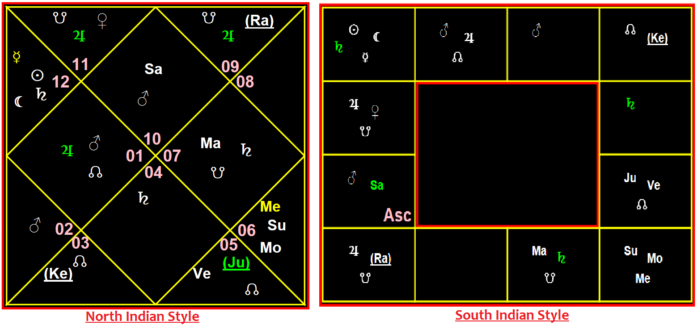

# Jyotichart is used to plot the astrological charts in north indian and south indian format. 

The Sample charts generated for north indian and south indian style is shown below


## Jyotichart as blackbox
> This package takes astrological planetery and ascendant positions as input and draws the astrological chart and gives it as output as svg image file saved in given location. 

> You can create either **North Indian Chart** or **South Indian Chart**

> The default colours and configurations are as shown in above image but you can even customize the colours of signnumbers, lines, background colour , sign colour etc with this package.

> By default the planets and its aspects are also plotted in the chart. However you can customise to disable the aspects and see only planet positions. 

---
---

## Steps to draw North Indian Chart or South Indian Chart
1. import the package **jyotichart** in the module.
    ```python
        import jyotichart as chart
    ```

2. Create an instance object of NorthIndian/SouthIndian chart class by passing **chart name** and **person name** whose astrological chart you want to create. There is an optional parrameter too called **IsFullChart** which is by default is **True**. If you keep this parameter true then the positions oif all the planets need to be provided before drawing the chart. Hence the name full chart. If you make this parameter as **False**, that means this is a partial chart which can be drawn with no planets or with subset of planets. 
    ```python
        #For full NorthIndian chart
        mychart1 = chart.NorthChart("Lagna", "Shyam Bhat")

        #For partial NorthIndian chart
        mychart2 = chart.NorthChart("Special", "Deepa Saravi", IsFullChart = False)

        #For full SouthIndian chart
        mychart3 = chart.SouthChart("Lagna", "Shyam Bhat")

        #For partial SouthIndian chart
        mychart4 = chart.SouthChart("Special", "Deepa Saravi", IsFullChart = False)
    ```
    > From now on this object will be refered in code snippets as `mychart`. But in your code you have to take one of `mychart1`, `mychart2`, `mychart3` or `mychart4` depending on your needs. 

3. The Ascendant Sign has to be provided which will be the first house in the chart. This is done by invoking object method `set_ascendantsign()` and the sign is passed as input parameter. There are 12 signs in astrology and pass anyone from below list as a string to this method: `"Aries"`, `"Taurus"`, `"Gemini"`, `"Cancer"`, `"Leo"`, `"Virgo"`, `"Libra"`, `"Scorpio"`, `"Saggitarius"`, `"Capricorn"`, `"Aquarius"`, `"Pisces"`. Make sure the parameter is same as given above. If case and spelling is wrong then the functionality will not work. For example if you want to set the ascendant sign to Capricorn then you can do as shown below:
    ```python
        mychart.set_ascendantsign("Capricorn")
    ```

4. Next Provide details of the planets. Each planet detail can be added to the chart by invoking the method `add_planet()`. This method takes 3 mandatory parameters and 3 optional parameters which are explained below:
    
    Mandatory Parameters:
    - **planet** : The planet which is to be added. This is a string value from the list: [`"Sun"`, `"Moon"`, `"Mars"`, `"Mercury"`, `"Jupiter"`, `"Venus"`, `"Saturn"`, `"Rahu"`, `"Ketu"`]. Instead of this strings you can use the constants provided by the package as well like for `"Sun"` You can use `chart.SUN`. These all values for planets can be copied from below shown code snippet which demonstrates usage of this method in this step.
    - **symbol** : This is also a string. Whatever you provide here will be updated in the chart to represent that planet. For Moon if you provide the symbol as `"Mo"` then in the chart diagram wherever moon is placed, you will see **Mo** as shown in chart diagram above.
    - **housenum** : This is a integer value between 1 to 12. As the name suggests it must be the house number in which the planet is placed. If planet has to be placed in 5th house then house number must be 5 and so on. Remember there are only 12 houses in jyotishya and so this parameter value cannot be more than 12 or even 0. values 0 and 13 and above are not valid. 

    Optional Parameters:
    - **retrograde** : This is a boolean value. By default this is `False` which means if this parameter is not provided then its assumed that the planet is non-retrograde (except for Rahu and Ketu who are always in retrograde motion) To make the planet retrograde, please provide this parameter value as `True`. In the diagram the retrograde planets will be underlined and will be put inside simple brackets (). You can see that for Rahu and Ketu in above given sample charts.
    - **aspectsymbol** : Similar to planet symbol, this is also a string. But this string will be to showcase the aspect of the planet in the chart diagram. Please make sure this symbol differs from the planet symbol to ensure the distinction between planet and its aspect in the chart to avoid the confusion. If this parameter is not given then default symbols for that planet will be used to show the aspect in case the aspect is not disabled. The default symbols are as follows: `SUN = "☉", MOON = "☾", MARS = "♂", MERCURY = "☿", JUPITER = "♃", VENUS = "♀", SATURN = "♄", RAHU = "☊", KETU = "☋"`
    - **colour** : This is the colour of the planet and its aspect in the chart. By default it is `'white'`. But if you want to change the colour of the planet in the chart diagram then you can do so using this parameter. 

    > Note: This method returns string value `"Success"` if the planet is added successfully to the chart. But if not then it returns the error message as return value if some fault occured. So please make sure you check the return value to confirm the planet is added successfully.

    The planets from Sun to Ketu can be added as shown in below code snippet as an example:
    ```python
        mychart.add_planet(chart.SUN,"Su", 9)
        mychart.add_planet(chart.MOON,"Mo", 9)
        mychart.add_planet(chart.MARS,"Ma", 10, aspectsymbol="m")
        mychart.add_planet(chart.MERCURY,"Me", 9, colour='yellow')
        mychart.add_planet(chart.JUPITER,"Ju", 8,colour="lime", retrograde=True)
        mychart.add_planet(chart.VENUS,"Ve", 8)
        mychart.add_planet(chart.SATURN,"Sa", 1)
        mychart.add_planet(chart.RAHU,"Ra", 12)
        mychart.add_planet(chart.KETU,"Ke", 6)
    ```
    This results in chart generated as shown below:

    
    

5. Now since you provided all the details of ascendant and planets you are ready to draw the chart. But before doing that you even have option to update the chart coinfigurations like changing the chart colours like line colour, background colour etc and enabling or disabling the aspect visibilities etc in the chart before plotting. This can be done by using the method `updatechartcfg()`. This method has all optional parameters with each parameter representing a different chart property. If you invoke this method without any parameters then ot resets all configurations with default values. If you want to update some properties then you can provide thoise corresponding parameters only with your chosen values. The parameters of this method are given below:
    - **aspect** : Default value is `True`. It's a boolean value indicating if the planet aspects should be visible on the chart or not. To disable the aspects only you can do this : `mychart.updatechartcfg(aspect=False)`
    - **clr_background** : Default value is `'black'`. It's a string value indicating the colour of the background of the chart. 
    - **clr_outbox** : Default value is `'red'`. It's a string value indicating the colour of the outer square box of the chart. 
    - **clr_line** : Default value is `'yellow'`. It's a string value indicating the colour of the lines of the chart.
    - **clr_sign** / **clr_Asc** : Default value is `'pink'`. It's a string value indicating the colour of the sign numbers on the chart for north indian chart and colour of Asc in south indian chart. 
    - **clr_houses** : Default value is `'black'` for all 12 houses or signs. It's a list of 12 values with each value being string value indicating the colour of the corresponding house for north indian chart and signs for south indian chart on the chart. 

    Below code snippet demonstrates the usage of method `updatechartcfg()`. Here we will make aspects invisible on the chart. Also the background colour will be made yellow, line colour be made white, sign colour be made lime green. houses 1,5,9 be made green. houses 6,8,12 be made red and remaining houses will be kept black. Remember all config changes has to be made in a single call. if invoked multiple times then oit will be as if only last call was valid and all previopus calls will be nullified.

    ```python
        housecolours = ['black', 'black', 'black', 'black', 'black', 'black', 'black', 'black', 'black', 'black', 'black', 'black']
        housecolours[0] = 'green'   #FIRST HOUSE OR ARIES (HOUSE FOR NORTH STYLE AND SIGN FOR SOUTH STYLE)
        housecolours[4] = 'green'   #FIFTH HOUSE OR LEO (HOUSE FOR NORTH STYLE AND SIGN FOR SOUTH STYLE)
        housecolours[8] = 'green'   #NINTH HOUSE OR SAGGITARIUS (HOUSE FOR NORTH STYLE AND SIGN FOR SOUTH STYLE)
        housecolours[5] = 'red'   #SIXTH HOUSE OR VIRGO (HOUSE FOR NORTH STYLE AND SIGN FOR SOUTH STYLE)
        housecolours[7] = 'red'   #EIGHTH HOUSE OR SCORPIO (HOUSE FOR NORTH STYLE AND SIGN FOR SOUTH STYLE)
        housecolours[11] = 'red'   #TWELFTH HOUSE OR PISCES (HOUSE FOR NORTH STYLE AND SIGN FOR SOUTH STYLE)

        #For north indian style
        mychart.updatechartcfg(aspect=False, clr_background='yellow', clr_line='white', clr_sign='lime', clr_houses=housecolours)

        #For south iundian style
        mychart.updatechartcfg(aspect=False, clr_background='yellow', clr_line='white', clr_Asc='lime', clr_houses=housecolours)

    ```

    As a result the chart image would be generated as shown below:

    
    

6. Once all the needed inputs are given, we can draw the chart now by invoking the method `draw`. This method takes just 2 input parameters as shown below:
    - **location** : Where the drawn chart has to be stored. This has to be a valid location in your current computer and the code needs to have write access to that location.
    - **filename** : Name of the file as a alphanumeric string which will be given to the svg image to be drawn. Please **do not include** the extension in this parameter. 

    The below code sinippet demonstrates usage of `draw` method to create the north indian style chart in svg format. 

    ```python
        mychart.draw("C:/Users/hp/Downloads/astrocharts", "LagnaChart")
    ```

> Note: If you want to modify the properties of a planet after adding, Then you have to delete that planet entry and then add it agaion with new properties. To delete a planet entry added you can use `delete_planet` method. To this only the planet name is input parameter. Example usage is shown in below snippet:
>   ```python
>       mychart.delete_planet(chart.MERCURY)
>   ```

Below Code snippet gives you an example of plotting Full North Indian chart which you can see in above sample chart:

```python
    import jyotichart as chart

    #For north chart
    mychart = chart.NorthChart("Lagna", "Shyam Bhat", IsFullChart = True)

    #For south chart
    mychart = chart.SouthChart("Lagna", "Shyam Bhat", IsFullChart = True)

    mychart.set_ascendantsign("Capricorn")
    mychart.add_planet(chart.SUN,"Su", 9)
    mychart.add_planet(chart.MOON,"Mo", 9)
    mychart.add_planet(chart.MARS,"Ma", 10)
    mychart.add_planet(chart.MERCURY,"Me", 9, colour='yellow')
    mychart.add_planet(chart.JUPITER,"Ju", 8,colour="lime", retrograde=True)
    mychart.add_planet(chart.VENUS,"Ve", 8)
    mychart.add_planet(chart.SATURN,"Sa", 1)
    mychart.add_planet(chart.RAHU,"Ra", 12)
    mychart.add_planet(chart.KETU,"Ke", 6)

    mychart.updatechartcfg(aspect=False)

    mychart.draw("C:/Users/hp/Downloads/astrocharts", "LagnaChart")

```


