# Jyotichart


Jyotichart is a Python library for generating beautiful, highly customizable astrological charts in SVG format. It supports both **North Indian (Diamond)** and **South Indian (Square)** styles, including full natal charts, partial charts, transit overlays, and numerical representations (like Ashtakavarga).


---


## Features


- **Multiple Chart Styles**: Generate North Indian and South Indian format charts.

- **Full & Partial Charts**: Plot a complete horoscope or just a subset of specific planets.

- **Transit Overlays**: Generate transit charts that elegantly overlay transit planets on top of a base natal chart.

- **Numerical Charts**: Generate charts that show numerical values in each house (useful for Ashtakavarga or Bhava Bala).

- **High Customizability**: Adjust colors for the background, outer/inner boxes, specific signs, planet text, and toggle planetary aspects.

- **Rich Center Information**: Display Birth Details, Chart Type, Name, and overlay details directly in the chart center.


---


## Installation


Install the package using pip:


```bash

pip install jyotichart
```


---


## Required Python Libraries


Jyotichart is a **pure-Python** library with **no external dependencies**. It only uses modules from the Python Standard Library:


| Library | Purpose | Included With |
|---------|---------|---------------|
| `os`    | File path and directory handling | Python Standard Library |


The library generates SVG files that can be opened in any modern web browser or SVG viewer.


> **Python version requirement**: Python 3.7 or higher (as specified in `pyproject.toml`).


---


## Usage Guide


### 1. Generating a Natal Chart (Full)


You can generate a classic full Natal Chart by providing the ascendant sign and adding all 9 planets. If you leave `IsFullChart=True` (the default), the chart will safely throw an error if you forget to add a planet.


```python
import jyotichart as chart


# 1. Initialize the North Indian Chart (or use SouthChart for South Indian style)

north = chart.NorthChart("D1 Natal", "John Doe")


# 2. Add Birth Details (will automatically appear perfectly centered)

north.set_birth_details("08 October 1991", "14:47", "New York")


# 3. Set the Ascendant sign

north.set_ascendantsign("Aries")


# 4. Add Planets

north.add_planet(chart.SUN, "Su", 1)

north.add_planet(chart.MOON, "Mo", 2)

north.add_planet(chart.MARS, "Ma", 3)

north.add_planet(chart.MERCURY, "Me", 4)

# Add retrograde planet (will have an underline)

north.add_planet(chart.JUPITER, "Ju", 5, retrograde=True)

north.add_planet(chart.VENUS, "Ve", 6)

north.add_planet(chart.SATURN, "Sa", 7)

north.add_planet(chart.RAHU, "Ra", 8)

north.add_planet(chart.KETU, "Ke", 2)


# 5. Save the chart as an SVG file

north.draw("output_directory/", "north_natal", "svg")
```


#### Outputs:

|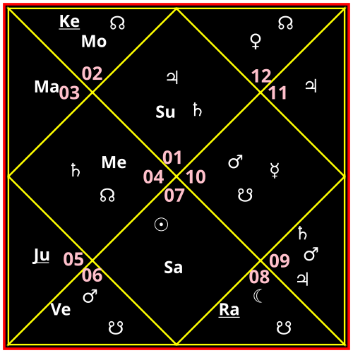|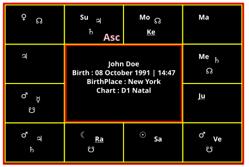|
|:---:|:---:|
| **North Indian Natal** | **South Indian Natal** |


---


### 2. Generating a Partial Chart


If you only want to display a subset of planets (for example, to emphasize a specific conjunction), you must pass `IsFullChart=False` during initialization. The chart will render successfully even with missing planets.


#### A. North Indian Partial Chart
```python
import jyotichart as chart


# 1. Initialize the chart as a partial chart

n_partial = chart.NorthChart("Partial", "Alice", IsFullChart=False)

n_partial.set_ascendantsign("Leo")


# 2. Only add a few specific planets

n_partial.add_planet(chart.SUN, "Su", 1)

n_partial.add_planet(chart.JUPITER, "Ju", 9)


# 3. Draw the chart

n_partial.draw("output_directory/", "north_partial", "svg")
```


#### B. South Indian Partial Chart
```python
import jyotichart as chart


# 1. Initialize the chart as a partial chart

s_partial = chart.SouthChart("Partial", "Alice", IsFullChart=False)

s_partial.set_ascendantsign("Leo")


# 2. Only add a few specific planets

s_partial.add_planet(chart.SUN, "Su", 1)

s_partial.add_planet(chart.JUPITER, "Ju", 9)


# 3. Draw the chart

s_partial.draw("output_directory/", "south_partial", "svg")
```


#### Outputs:

|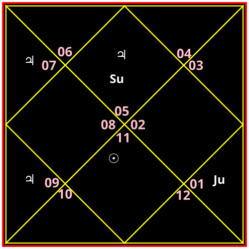|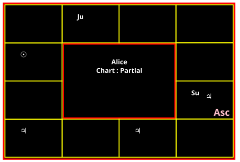|
|:---:|:---:|
| **North Indian Partial** | **South Indian Partial** |


---


### 3. Customizing Colors (Houses, Planets, and Signs)


You can thoroughly customize the look and feel of your charts. This feature is available identically for all chart types (North, South, Transit, Numerical).


1. **Planet Colors**: Use the `colour="..."` argument inside `add_planet`.

2. **Sign Numbers (North) / Ascendant Label (South)**: Use `clr_sign="..."` inside `updatechartcfg`.

3. **Backgrounds and Lines**: Use `clr_background="..."` and `clr_line="..."`.

4. **Individual House Colors**: Pass an array of 12 colors to `clr_houses="..."`.


```python
import jyotichart as chart


# Create a chart

n_custom = chart.NorthChart("Colored", "Custom User", IsFullChart=True)

n_custom.set_ascendantsign("Gemini")


# 1. Customize the Planet color (set Venus to Cyan)

n_custom.add_planet(chart.SUN, "Su", 1)

n_custom.add_planet(chart.MOON, "Mo", 2)

n_custom.add_planet(chart.MARS, "Ma", 3)

n_custom.add_planet(chart.MERCURY, "Me", 4)

n_custom.add_planet(chart.VENUS, "Ve", 5, colour="cyan")

n_custom.add_planet(chart.JUPITER, "Ju", 6)

n_custom.add_planet(chart.SATURN, "Sa", 7)

n_custom.add_planet(chart.RAHU, "Ra", 8)

n_custom.add_planet(chart.KETU, "Ke", 2)


# 2. Customize Individual House Background Colors

# Create a list of 12 colors for the 12 houses (default is 'black')

housecolours = ['black'] * 12

housecolours[0] = '#2b2b2b' # Color the 1st house (or Aries in South Chart)

housecolours[4] = '#3d1212' # Color the 5th house (or Leo in South Chart)


# 3. Update the global chart configuration

n_custom.updatechartcfg(

    aspect=False,               # Disable planetary aspect lines

    clr_background='#1a1a1a',   # Main background color of the chart

    clr_line='orange',          # Grid lines color

    clr_sign='yellow',          # Sign numbers / Ascendant text color

    clr_houses=housecolours     # Apply the custom house background colors

)


# Draw the customized chart

n_custom.draw("output_directory/", "north_custom", "svg")
```


#### Outputs:

|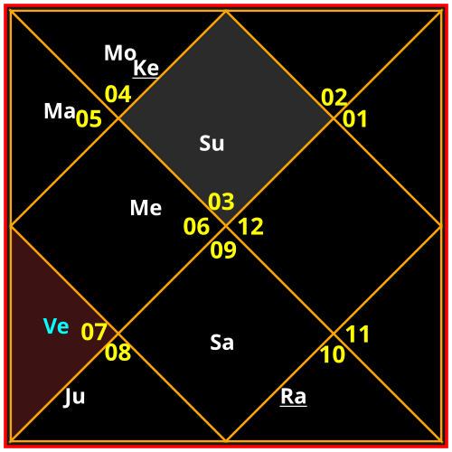|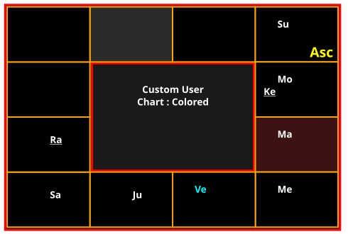|
|:---:|:---:|
| **Custom Colored North** | **Custom Colored South** |


---


### 4. Toggling Planetary Aspects


By default, Jyotichart draws the aspect lines of all planets (for example, Mars' 4th, 7th, and 8th aspects). You can easily hide them to reduce visual clutter using the `updatechartcfg` method.


```python
import jyotichart as chart


my_chart = chart.NorthChart("D1 Natal", "John Doe", IsFullChart=False)

my_chart.set_ascendantsign("Aries")

my_chart.add_planet(chart.JUPITER, "Ju", 1)


# Set aspect=False to hide the aspect lines

my_chart.updatechartcfg(aspect=False)


my_chart.draw("output_directory/", "hidden_aspects", "svg")
```


#### Output:

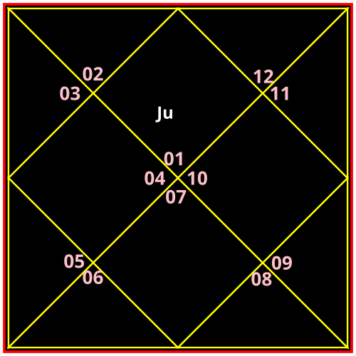


---


### 5. Generating a Transit Chart


You can create transit charts that perfectly overlay current transit planets onto a pre-existing natal chart. The natal planets stay in the inner loop, while the transit planets orbit in the outer boxes. Because these charts contain a high density of information (18 planets in total), it is highly recommended to disable aspects (`aspect=False`) to avoid visual clutter.


#### A. North Indian Transit Chart


```python
import jyotichart as chart


# 1. Create your base Natal chart with all planets

base_north = chart.NorthChart("D1 Natal", "John Doe")

base_north.set_ascendantsign("Aries")

base_north.add_planet(chart.SUN, "Su", 1)

base_north.add_planet(chart.MOON, "Mo", 2)

base_north.add_planet(chart.MARS, "Ma", 3)

base_north.add_planet(chart.MERCURY, "Me", 4)

base_north.add_planet(chart.JUPITER, "Ju", 5, retrograde=True)

base_north.add_planet(chart.VENUS, "Ve", 6)

base_north.add_planet(chart.SATURN, "Sa", 7)

base_north.add_planet(chart.RAHU, "Ra", 8)

base_north.add_planet(chart.KETU, "Ke", 2)

# Turn off inner chart aspects to reduce clutter

base_north.updatechartcfg(aspect=False)


# 2. Create the Transit Chart overlaying the base chart

n_transit = chart.NorthTransitChart("Transit", "John Doe", base_north)


# 3. Add transit planets (these will go in the outer ring)

n_transit.add_planet(chart.SUN, "Su", 10)

n_transit.add_planet(chart.MOON, "Mo", 12)

n_transit.add_planet(chart.MARS, "Ma", 1)

n_transit.add_planet(chart.MERCURY, "Me", 2)

n_transit.add_planet(chart.JUPITER, "Ju", 3)

n_transit.add_planet(chart.VENUS, "Ve", 4)

n_transit.add_planet(chart.SATURN, "Sa", 5)

n_transit.add_planet(chart.RAHU, "Ra", 6)

n_transit.add_planet(chart.KETU, "Ke", 12)


# 4. Turn off outer chart aspects and draw the overlay chart

n_transit.updatechartcfg(aspect=False)

n_transit.draw("output_directory/", "north_transit", "svg")
```

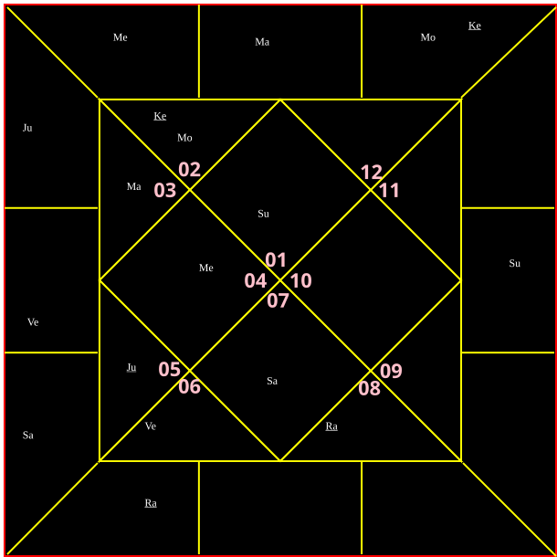


---


#### B. South Indian Transit Chart


```python
import jyotichart as chart


# 1. Create your base Natal chart with all planets

base_south = chart.SouthChart("D1 Natal", "John Doe")

base_south.set_ascendantsign("Aries")

base_south.add_planet(chart.SUN, "Su", 1)

base_south.add_planet(chart.MOON, "Mo", 2)

base_south.add_planet(chart.MARS, "Ma", 3)

base_south.add_planet(chart.MERCURY, "Me", 4)

base_south.add_planet(chart.JUPITER, "Ju", 5, retrograde=True)

base_south.add_planet(chart.VENUS, "Ve", 6)

base_south.add_planet(chart.SATURN, "Sa", 7)

base_south.add_planet(chart.RAHU, "Ra", 8)

base_south.add_planet(chart.KETU, "Ke", 2)

# Turn off inner chart aspects to reduce clutter

base_south.updatechartcfg(aspect=False)


# 2. Create the Transit Chart overlaying the base chart

s_transit = chart.SouthTransitChart("Transit", "John Doe", base_south)

s_transit.set_transit_details("12 Jan 2026", "10:00")


# 3. Add transit planets (these will go in the outer ring)

s_transit.add_planet(chart.SUN, "Su", 10)

s_transit.add_planet(chart.MOON, "Mo", 12)

s_transit.add_planet(chart.MARS, "Ma", 1)

s_transit.add_planet(chart.MERCURY, "Me", 2)

s_transit.add_planet(chart.JUPITER, "Ju", 3)

s_transit.add_planet(chart.VENUS, "Ve", 4)

s_transit.add_planet(chart.SATURN, "Sa", 5)

s_transit.add_planet(chart.RAHU, "Ra", 6)

s_transit.add_planet(chart.KETU, "Ke", 12)


# 4. Turn off outer chart aspects and draw the overlay chart

s_transit.updatechartcfg(aspect=False)

s_transit.draw("output_directory/", "south_transit", "svg")
```

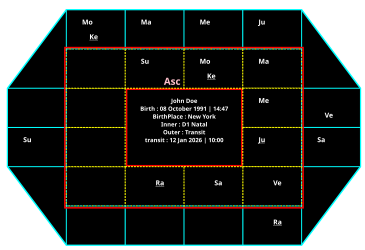


---


### 6. Generating Numerical Charts


If you need to plot Ashtakavarga points, Bhava Bala, or any single numerical/text value per house, you can use Numerical Charts. 


#### A. North Indian Numerical Chart (e.g. Bhava Bala)


```python
import jyotichart as chart


# Initialize a Numerical Chart

n_num = chart.NorthNumericalChart("Bhava Bala", "User")

n_num.set_ascendantsign("Libra")


# Provide an array of realistic numerical data for the 12 houses

north_values = [324, 156, 210, 489, 512, 123, 765, 890, 432, 234, 567, 876]


# Loop through houses 1 to 12 and set the numerical value

for i in range(1, 13):

    n_num.set_house_value(i, north_values[i-1])


n_num.draw("output_directory/", "north_numerical", "svg")
```


#### B. South Indian Numerical Chart (e.g. Ashtakavarga)


```python
import jyotichart as chart


# Initialize a Numerical Chart

s_num = chart.SouthNumericalChart("Ashtakavarga", "User")

s_num.set_ascendantsign("Libra")


# Provide an array of realistic numerical data for the 12 houses

south_values = [2, 5, 8, 3, 1, 9, 4, 7, 6, 2, 8, 5]


# Loop through houses 1 to 12 and set the numerical value

for i in range(1, 13):

    s_num.set_house_value(i, south_values[i-1])


s_num.draw("output_directory/", "south_numerical", "svg")
```


#### Outputs:

|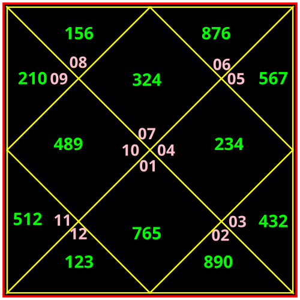|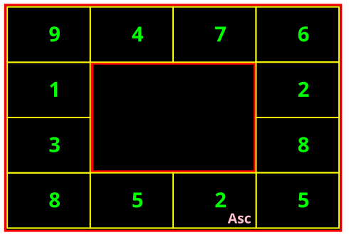|
|:---:|:---:|
| **North Indian Numerical** | **South Indian Numerical** |


---


### 7. Language Support

Jyotichart supports **three languages** for chart labels, planet abbreviations, the Ascendant marker, and center box text. The default is English, and **all 6 chart types** accept the `language` parameter.

**Supported languages:** `"english"` *(default)*, `"kannada"`, `"hindi"`

#### How Language Works Across Chart Types

| Feature | North Indian Charts | South Indian Charts |
|---|---|---|
| Planet symbols | User-provided via `add_planet()` — use `get_planet_symbol()` helper | Same |
| House numbers (01-12) | **Always numeric** — language does not change these | N/A |
| "Asc" marker | N/A (uses numeric sign numbers) | Translated automatically |
| Center labels (Birth, BirthPlace, Chart) | N/A | Translated automatically |
| Transit chart variants | Supported | Supported |
| Numerical chart variants | Supported | Supported (Asc label translated) |

> **Note:** House/sign numbers in North Indian charts are always displayed as numeric digits (01-12) regardless of the selected language, since numbers are universally understood in astrology contexts.

---

#### Planet Abbreviations by Language

| Planet  | English | Kannada | Hindi |
|---------|---------|---------|-------|
| Sun     | `Su`    | `ಸೂ`   | `सू` |
| Moon    | `Mo`    | `ಚಂ`   | `चं` |
| Mars    | `Ma`    | `ಮಂ`   | `मं` |
| Mercury | `Me`    | `ಬು`   | `बु` |
| Jupiter | `Ju`    | `ಗು`   | `गु` |
| Venus   | `Ve`    | `ಶು`   | `शु` |
| Saturn  | `Sa`    | `ಶ`    | `श`  |
| Rahu    | `Ra`    | `ರಾ`   | `रा` |
| Ketu    | `Ke`    | `ಕೇ`   | `के` |

---

#### A. North Indian Chart in Kannada
```python
import jyotichart as chart

# 1. Initialize with language="kannada"
north = chart.NorthChart("D1 ಲಗ್ನ", "ರಾಮ", language="kannada")
north.set_ascendantsign("Scorpio")

# 2. Use get_planet_symbol() to automatically get Kannada abbreviations
north.add_planet(chart.SUN,     chart.get_planet_symbol(chart.SUN,     "kannada"), 1)
north.add_planet(chart.MOON,    chart.get_planet_symbol(chart.MOON,    "kannada"), 4)
north.add_planet(chart.MARS,    chart.get_planet_symbol(chart.MARS,    "kannada"), 10)
north.add_planet(chart.MERCURY, chart.get_planet_symbol(chart.MERCURY, "kannada"), 1)
north.add_planet(chart.JUPITER, chart.get_planet_symbol(chart.JUPITER, "kannada"), 9)
north.add_planet(chart.VENUS,   chart.get_planet_symbol(chart.VENUS,   "kannada"), 2)
north.add_planet(chart.SATURN,  chart.get_planet_symbol(chart.SATURN,  "kannada"), 7)
north.add_planet(chart.RAHU,    chart.get_planet_symbol(chart.RAHU,    "kannada"), 12)
north.add_planet(chart.KETU,    chart.get_planet_symbol(chart.KETU,    "kannada"), 6)

# 3. House numbers (01-12) remain as English numerals always
north.updatechartcfg(aspect=False)
north.draw("output_directory/", "north_kannada", "svg")
```

#### Output:
|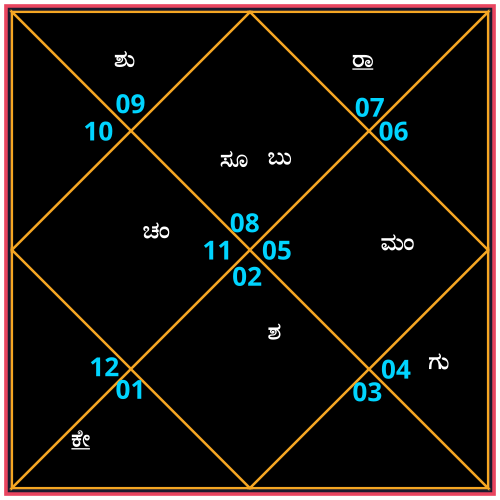|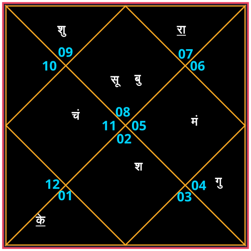|
|:---:|:---:|
| **North Indian - Kannada** | **North Indian - Hindi** |

---

#### B. North Indian Chart in Hindi
```python
import jyotichart as chart

# 1. Initialize with language="hindi"
north = chart.NorthChart("D1 कुंडली", "राम", language="hindi")
north.set_ascendantsign("Scorpio")

# 2. Use get_planet_symbol() to automatically get Hindi abbreviations
north.add_planet(chart.SUN,     chart.get_planet_symbol(chart.SUN,     "hindi"), 1)
north.add_planet(chart.MOON,    chart.get_planet_symbol(chart.MOON,    "hindi"), 4)
north.add_planet(chart.MARS,    chart.get_planet_symbol(chart.MARS,    "hindi"), 10)
north.add_planet(chart.MERCURY, chart.get_planet_symbol(chart.MERCURY, "hindi"), 1)
north.add_planet(chart.JUPITER, chart.get_planet_symbol(chart.JUPITER, "hindi"), 9)
north.add_planet(chart.VENUS,   chart.get_planet_symbol(chart.VENUS,   "hindi"), 2)
north.add_planet(chart.SATURN,  chart.get_planet_symbol(chart.SATURN,  "hindi"), 7)
north.add_planet(chart.RAHU,    chart.get_planet_symbol(chart.RAHU,    "hindi"), 12)
north.add_planet(chart.KETU,    chart.get_planet_symbol(chart.KETU,    "hindi"), 6)

north.updatechartcfg(aspect=False)
north.draw("output_directory/", "north_hindi", "svg")
```

---

#### C. South Indian Chart in Kannada

On South Indian charts, the **"Asc"** marker automatically becomes **"ಲಗ್ನ"** and center box labels (Birth, BirthPlace, Chart) are rendered in Kannada.
```python
import jyotichart as chart

# 1. Initialize South Indian chart with Kannada language
south = chart.SouthChart("D1 ಲಗ್ನ", "ರಾಮ", language="kannada")

# 2. Birth details — center labels appear in Kannada automatically
#    Birth -> ಜನನ  |  BirthPlace -> ಜನ್ಮಸ್ಥಳ  |  Chart -> ಕುಂಡಲಿ  |  Asc -> ಲಗ್ನ
south.set_birth_details("15 Aug 1990", "08:30", "ಬೆಂಗಳೂರು")
south.set_ascendantsign("Scorpio")

# 3. Add planets with Kannada symbols
south.add_planet(chart.SUN,     chart.get_planet_symbol(chart.SUN,     "kannada"), 1)
south.add_planet(chart.MOON,    chart.get_planet_symbol(chart.MOON,    "kannada"), 4)
south.add_planet(chart.MARS,    chart.get_planet_symbol(chart.MARS,    "kannada"), 10)
south.add_planet(chart.MERCURY, chart.get_planet_symbol(chart.MERCURY, "kannada"), 1)
south.add_planet(chart.JUPITER, chart.get_planet_symbol(chart.JUPITER, "kannada"), 9)
south.add_planet(chart.VENUS,   chart.get_planet_symbol(chart.VENUS,   "kannada"), 2)
south.add_planet(chart.SATURN,  chart.get_planet_symbol(chart.SATURN,  "kannada"), 7)
south.add_planet(chart.RAHU,    chart.get_planet_symbol(chart.RAHU,    "kannada"), 12)
south.add_planet(chart.KETU,    chart.get_planet_symbol(chart.KETU,    "kannada"), 6)

south.updatechartcfg(aspect=False)
south.draw("output_directory/", "south_kannada", "svg")
```

#### D. South Indian Chart in Hindi

On South Indian charts with Hindi, the **"Asc"** marker becomes **"लग्न"** and center labels (जन्म, जन्मस्थान, कुंडली) are rendered in Hindi.
```python
import jyotichart as chart

# 1. Initialize South Indian chart with Hindi language
south = chart.SouthChart("D1 कुंडली", "राम", language="hindi")

# 2. Birth details — center labels appear in Hindi automatically
#    Birth -> जन्म  |  BirthPlace -> जन्मस्थान  |  Chart -> कुंडली  |  Asc -> लग्न
south.set_birth_details("15 Aug 1990", "08:30", "दिल्ली")
south.set_ascendantsign("Scorpio")

# 3. Add planets with Hindi symbols
south.add_planet(chart.SUN,     chart.get_planet_symbol(chart.SUN,     "hindi"), 1)
south.add_planet(chart.MOON,    chart.get_planet_symbol(chart.MOON,    "hindi"), 4)
south.add_planet(chart.MARS,    chart.get_planet_symbol(chart.MARS,    "hindi"), 10)
south.add_planet(chart.MERCURY, chart.get_planet_symbol(chart.MERCURY, "hindi"), 1)
south.add_planet(chart.JUPITER, chart.get_planet_symbol(chart.JUPITER, "hindi"), 9)
south.add_planet(chart.VENUS,   chart.get_planet_symbol(chart.VENUS,   "hindi"), 2)
south.add_planet(chart.SATURN,  chart.get_planet_symbol(chart.SATURN,  "hindi"), 7)
south.add_planet(chart.RAHU,    chart.get_planet_symbol(chart.RAHU,    "hindi"), 12)
south.add_planet(chart.KETU,    chart.get_planet_symbol(chart.KETU,    "hindi"), 6)

south.updatechartcfg(aspect=False)
south.draw("output_directory/", "south_hindi", "svg")
```

#### Outputs:
|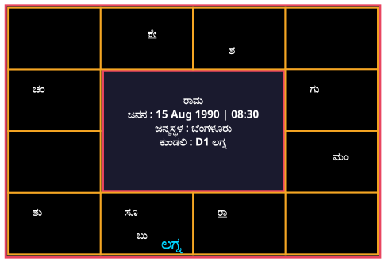|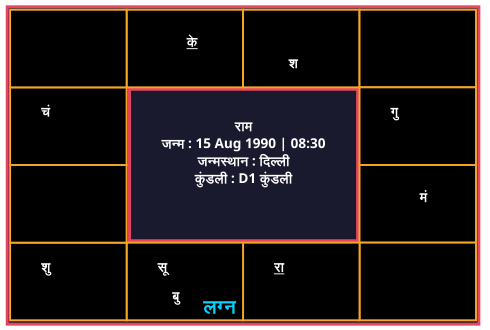|
|:---:|:---:|
| **South Indian - Kannada** | **South Indian - Hindi** |

---

#### Quick Reference: get_planet_symbol() and SUPPORTED_LANGUAGES
```python
import jyotichart as chart

# Get a single planet symbol in any language
chart.get_planet_symbol(chart.SUN, "kannada")  # returns "ಸೂ"
chart.get_planet_symbol(chart.SUN, "hindi")    # returns "सू"
chart.get_planet_symbol(chart.SUN, "english")  # returns "Su"

# Check all supported languages
print(chart.SUPPORTED_LANGUAGES)  # ['english', 'kannada', 'hindi']

# Build a full chart for any language efficiently with a loop
LANG = "kannada"   # switch to "hindi" or "english" as needed
planets = [chart.SUN, chart.MOON, chart.MARS, chart.MERCURY,
           chart.JUPITER, chart.VENUS, chart.SATURN, chart.RAHU, chart.KETU]
houses  = [1, 4, 10, 1, 9, 2, 7, 12, 6]

my_chart = chart.NorthChart("D1", "My Name", language=LANG)
my_chart.set_ascendantsign("Aries")
for planet, house in zip(planets, houses):
    my_chart.add_planet(planet, chart.get_planet_symbol(planet, LANG), house)
my_chart.updatechartcfg(aspect=False)
my_chart.draw("output_directory/", "my_chart", "svg")
```

---


## 8. Classes Reference


Jyotichart provides 6 primary chart classes to accommodate any formatting need:


1. **`NorthChart(chartname, personname, IsFullChart=True, language="english")`**: Renders a standard diamond-shaped North Indian chart.

2. **`SouthChart(chartname, personname, IsFullChart=True, language="english")`**: Renders a standard square-shaped South Indian chart.

3. **`NorthTransitChart(chartname, personname, parentNorthChart, IsFullChart=True, language="english")`**: Renders a North Indian chart with an outer orbit containing transit planets. You MUST pass a fully instantiated `NorthChart` as the `parentNorthChart` parameter.

4. **`SouthTransitChart(chartname, personname, parentSouthChart, IsFullChart=True, language="english")`**: Renders a South Indian chart with an outer orbit containing transit planets. You MUST pass a fully instantiated `SouthChart` as the `parentSouthChart` parameter.

5. **`NorthNumericalChart(chartname, personname, language="english")`**: Renders a North Indian chart specifically formatted to center a large numerical value in each house instead of planets.

6. **`SouthNumericalChart(chartname, personname, language="english")`**: Renders a South Indian chart specifically formatted to center a large numerical value in each house instead of planets.


---


## 9. API Reference & Methods


Below is a detailed reference of the most frequently used methods and parameters across the chart classes.


### `add_planet(planet, symbol, housenum, [retrograde], [aspectsymbol], [colour])`

Adds a planet to the chart in the specified house. **(Available on: Natal Charts, Transit Charts)**


**Mandatory Parameters:**

- `planet` (str): The planet to add. Use the provided constants: `chart.SUN`, `chart.MOON`, `chart.MARS`, `chart.MERCURY`, `chart.JUPITER`, `chart.VENUS`, `chart.SATURN`, `chart.RAHU`, `chart.KETU`.

- `symbol` (str): The text that will be displayed on the chart for this planet (e.g., `"Mo"`, `"Ju"`).

- `housenum` (int): The astrological house number (1-12) to place the planet in. 


**Optional Parameters:**

- `retrograde` (bool): Defaults to `False`. If `True`, the planet symbol will be underlined. (Note: Rahu and Ketu default to `True`).

- `aspectsymbol` (str): Symbol to use for the planet's aspect lines. If not provided, it uses traditional unicode astrological symbols (e.g. `♃` for Jupiter).

- `colour` (str): Defaults to `"white"`. Change the color of this specific planet text on the chart.


### `set_ascendantsign(sign)`

Sets the ascendant sign (Lagna), which dictates the numbering of the houses. **(Available on: Natal Charts, Numerical Charts)**

- `sign` (str): Must be exactly one of: `"Aries"`, `"Taurus"`, `"Gemini"`, `"Cancer"`, `"Leo"`, `"Virgo"`, `"Libra"`, `"Scorpio"`, `"Saggitarius"`, `"Capricorn"`, `"Aquarius"`, `"Pisces"`.


### `set_house_value(housenum, value, [colour])`

Sets the numerical value displayed at the center of a given house. **(Available on: Numerical Charts)**

- `housenum` (int): The astrological house number (1-12).

- `value` (int/str): The number (or short text string) to display in the house center.

- `colour` (str): Defaults to `"lime"`. The color of the value string.


### `updatechartcfg([aspect], [clr_background], [clr_outbox], [clr_line], [clr_sign], [clr_houses])`

Updates global chart colors and visibility configurations. Any parameters you omit will retain their default values. **(Available on: All Charts)**


- `aspect` (bool): `True` (default) or `False`. Toggles whether planetary aspect lines are drawn.

- `clr_background` (str): The main background color of the SVG. Defaults to `"black"`.

- `clr_outbox` (str): The border color of the chart. Defaults to `"red"`.

- `clr_line` (str): The color of the internal grid lines. Defaults to `"yellow"`.

- `clr_sign` (str): The color of the sign numbers. Defaults to `"pink"`.

- `clr_houses` (list of str): An array of 12 strings, allowing you to set an individual background color for each house.


### `get_planet_symbol(planet, language="english")`

Module-level helper function. Returns the planet abbreviation in the requested language. **(Module-level utility)**

- `planet` (str): Planet constant e.g. `chart.SUN`, `chart.MOON`, `"Mars"` etc.

- `language` (str): One of `"english"` (default), `"kannada"`, `"hindi"`.

- Returns a string like `"Su"` (english), `"ಸೂ"` (kannada), `"सू"` (hindi).


### `get_sign_name(sign, language="english")`

Module-level helper function. Returns the zodiac sign name in the requested language. **(Module-level utility)**

- `sign` (str): English sign name e.g. `"Aries"`, `"Scorpio"` etc.

- `language` (str): One of `"english"` (default), `"kannada"`, `"hindi"`.


### `set_birth_details(dob, tob, pob)` and `set_transit_details(date, time)`

Populates the center box of South Indian charts with highly structured metadata. **(Available on: SouthChart and SouthTransitChart respectively)**

- `dob` / `date` (str): The date string (e.g., `"08 October 1991"`).

- `tob` / `time` (str): The time string (e.g., `"14:47"`).

- `pob` (str): Place of birth (e.g., `"New York"`).


---


## Reference Constants


For convenience and readability, the library provides planet constants you can import and use directly without spelling them out as strings:
`chart.SUN`, `chart.MOON`, `chart.MARS`, `chart.MERCURY`, `chart.JUPITER`, `chart.VENUS`, `chart.SATURN`, `chart.RAHU`, `chart.KETU`.


For language support:
`chart.SUPPORTED_LANGUAGES` — list of all supported language codes: `["english", "kannada", "hindi"]`.


---


# Changelog


All notable changes to this project will be documented in this file.


## [6.0.0] - 2026-07-05


### Added

- **Multi-Language Support**: All 6 chart classes now accept a `language` parameter (`"english"` default, `"kannada"`, `"hindi"`). Planet abbreviations, sign labels, the Ascendant marker, and center box text (Birth, BirthPlace, Chart etc.) are automatically rendered in the selected language on South Indian charts.

- **`get_planet_symbol(planet, language)`**: New module-level helper that returns the correct planet abbreviation for the given language (e.g. `"ಸೂ"` for Sun in Kannada, `"सू"` for Sun in Hindi).

- **`get_sign_name(sign, language)`**: New module-level helper that returns the zodiac sign name in the given language.

- **`support/languages.py`**: Centralized translation module containing planet symbols, sign names, and UI labels for English, Kannada, and Hindi.

- **`SUPPORTED_LANGUAGES`**: Module-level constant listing all supported language codes.

- **Required Python Libraries section** in README: Documents that jyotichart has no external dependencies beyond the Python Standard Library.


---


## [5.0.0] - 2026-07-05


### Added

- **Partial Charts**: You can now generate charts with missing planets (e.g., just Sun and Jupiter) by initializing charts with `IsFullChart=False`. The chart will cleanly render without throwing missing planet validation errors.

- **Toggling Aspects**: Added the ability to completely disable planetary aspect lines via `updatechartcfg(aspect=False)` for cleaner, less cluttered outputs (especially useful in Transit Charts).

- **Extensive API Reference**: Massively updated README with complete, copy-pastable code samples, generated visual examples, and a comprehensive method and class reference.


### Fixed

- **Critical Class Variable Leak**: Fixed a major bug where `planets` were stored as a shared class variable. Previously, generating a full natal chart would cause subsequent partial charts to inappropriately display all 9 planets. This state leak has been patched across `NorthChart`, `SouthChart`, `NorthTransitChart`, and `SouthTransitChart`.

- **Retrograde Rendering Cleanup**: Removed the parentheses `()` around retrograde planets to reduce visual noise. Retrograde planets are now exclusively indicated by an underline (e.g. `Ju` underlined).


### Changed

- **Transit Layout Updates**: North and South Indian Transit charts have been structurally refined for better label visibility and inner/outer orbit distinctions.

- **Center Box Text Optimization**: Overhauled the central text area for South Indian charts (and transit charts) to tightly fit Birth Details, Chart Name, and Transit Dates without overlapping the borders.


---


## [4.0.0] - Previous Release

- Initial stable release including base North/South natal and numerical charts.

